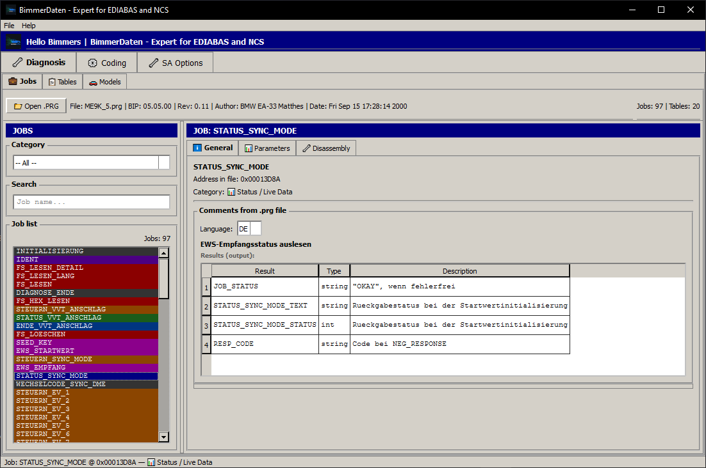
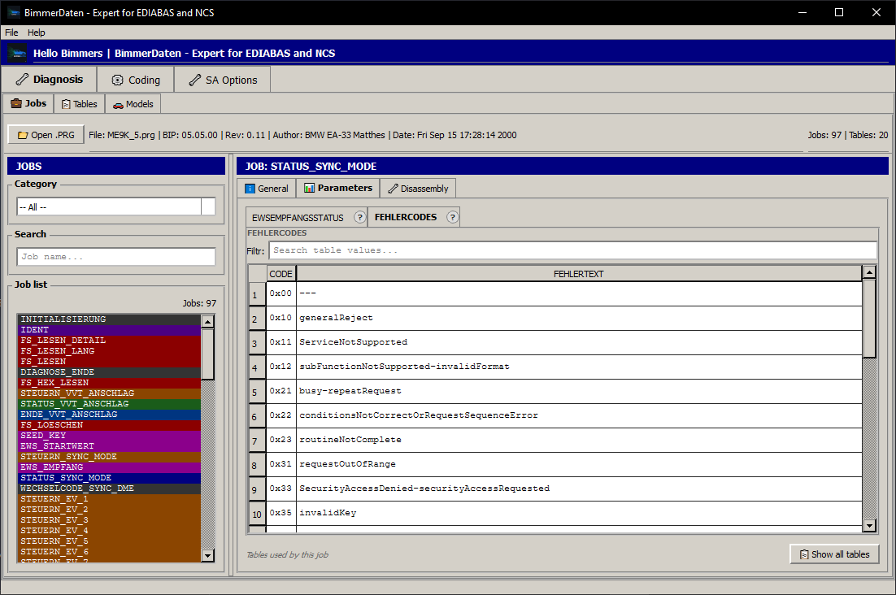
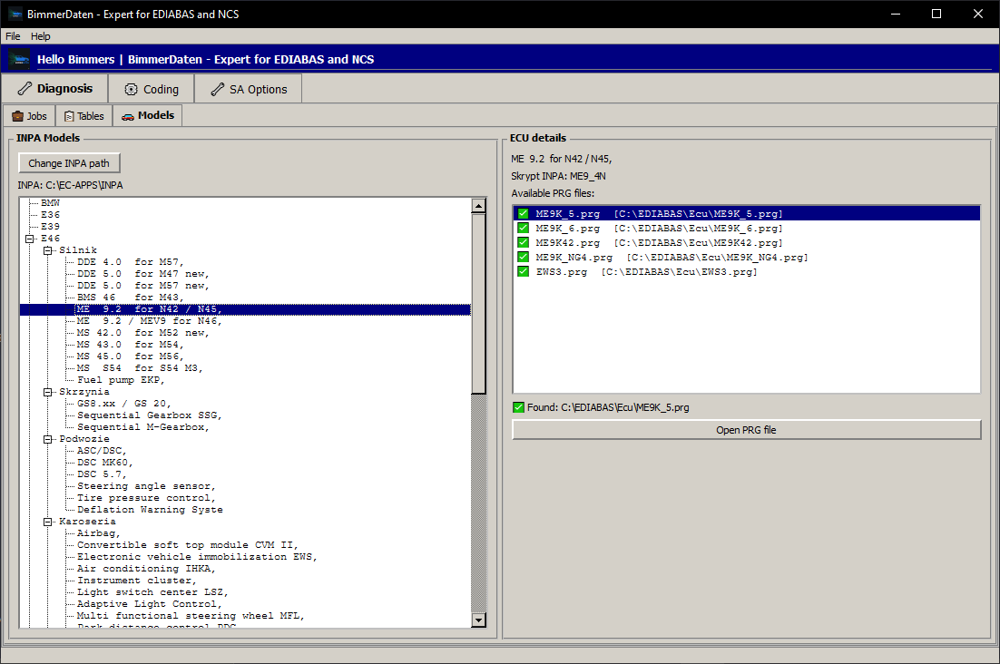
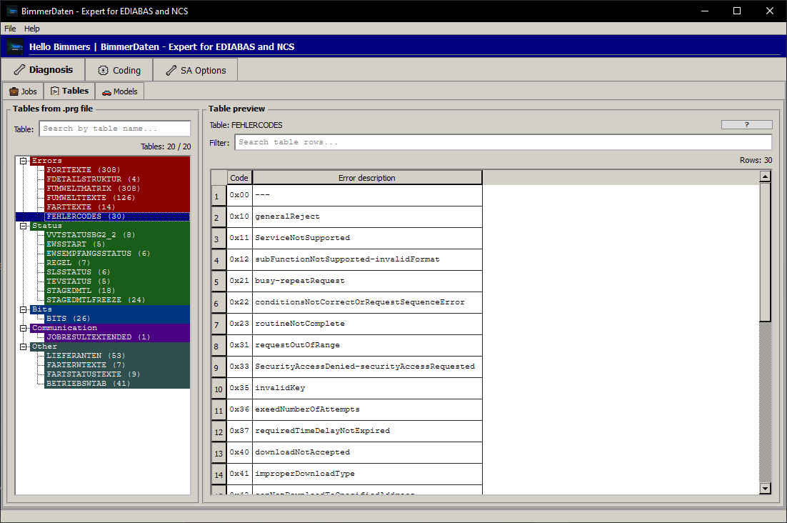
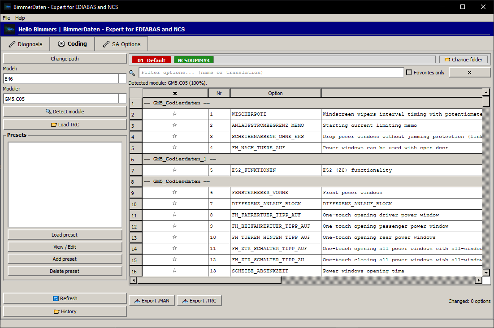
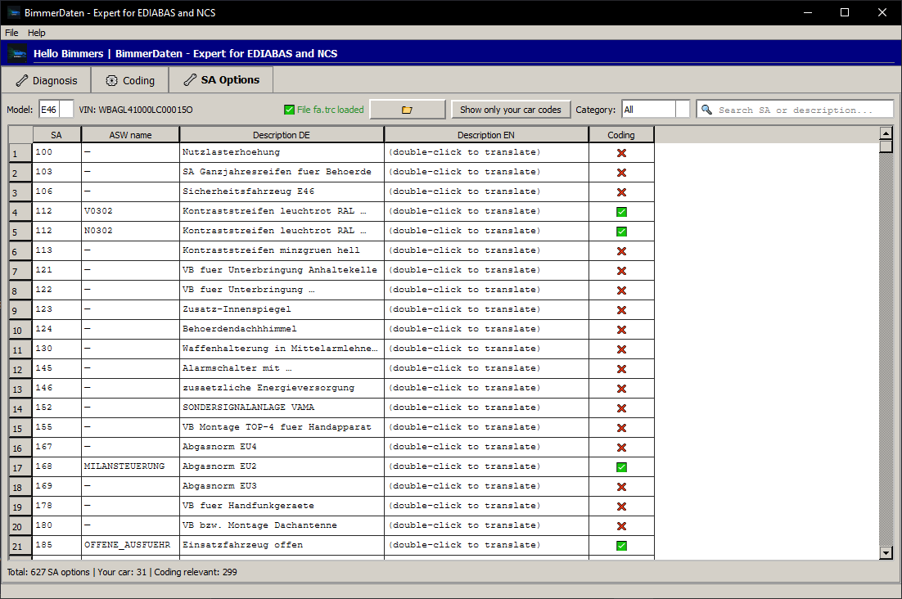
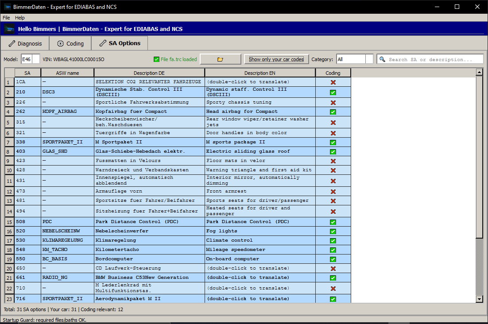

<h1 align="center">BimmerDaten</h1>
<p align="center"><em>A modern companion for BMW EDIABAS and NCS Expert</em></p>
<p align="center">
  <a href="LICENSE"></a>
  
  
  
  
</p>

---

## What is it?

BimmerDaten is a Windows desktop application for enthusiasts and technicians working with BMW diagnostic and coding files. It provides a clean, modern interface for exploring EDIABAS job files (`.prg`) and editing NCS Expert coding files (`.trc`) — tasks that traditionally required using old, cryptic BMW tools with no real visibility into what you were actually changing.

If you have ever used NCS Expert or Tool32 and thought *"there must be a better way to see what this module actually does"* — this is that better way.

---

## Why not NCS Dummy or Tool32?

| | NCS Dummy | Tool32 | BimmerDaten |
|---|---|---|---|
| Coding TRC files | ✅ | ❌ | ✅ |
| Coding parameter translations (NCS) | ✅ ¹ | ❌ | ✅ ¹ |
| View EDIABAS jobs | ❌ | ✅ | ✅ |
| Job parameters & descriptions | ❌ | ✅ | ✅ |
| Job / EDIABAS translations (DE→EN/PL) | ❌ | ❌ | ✅ ² |
| Live data table viewer | ❌ | partial | ✅ |
| Change tracking & history | ❌ | ❌ | ✅ |
| FA/SA decoder | ❌ | ❌ | ✅ |
| PDF export | ❌ | ❌ | ✅ |
| Modern UI | ❌ | ❌ | ✅ |

> ¹ Coding parameter translations (module options, their descriptions and interdependencies)
> are sourced from NCS Dummy's `Translations.csv` © REVTOR. BimmerDaten reads this file
> from your local NCS Dummy installation — it is never bundled with this project.
> Both tools share the same data source here; BimmerDaten does not improve on it.
>
> ² Job descriptions and EDIABAS-related translations are BimmerDaten's own offline DB
> with automatic online fallback. This is entirely independent of NCS Dummy.

BimmerDaten is not a replacement for BMW Standard Tools — it works alongside them. You still need EDIABAS and NCS Expert installed. BimmerDaten reads the same files and gives you a much better view of their contents.

---

## Features

### EDIABAS Job Viewer
- Browse all jobs inside any `.prg` ECU file
- View job input arguments (ARG), output results (RESULT) with types and descriptions
- Live data parameter table (BETRIEBSWTAB) with byte positions, scaling factors, and DS2 telegram breakdown
- Per-job table viewer — see which tables a job uses and browse their contents
- Full disassembly view of BEST/1 bytecode
- Automatic job categorization (fault memory, live data, coding, identification, etc.)

### NCS Expert Coding
- Load and edit FSW/PSW coding files (`.trc`) then export it to .MAN file to upload it do your Bimmer
- Human-readable parameter names via NCS Dummy's `Translations.csv`
- Automatic module detection from TRC content
- Change tracking — see exactly what you changed vs. the original
- Coding history with comparison and filtering
- PDF export of coding reports
- Coding presets — save, apply and share named coding configurations

### Translations
- **EDIABAS jobs** — own offline DB (DE → EN, PL) with automatic online fallback; online results are saved locally for future use
- **Coding parameters (NCS)** — reads NCS Dummy's `Translations.csv` (© REVTOR) from your local installation; includes full parameter context and interdependencies authored by REVTOR
- **FA/SA option codes** — online lookup, results cached locally

### Other
- INPA model parser with script-to-PRG file discovery
- FA/SA decoder for `AT.000` and `fa.trc` files
- SQLite-based local database — no cloud, no account required

---

## Requirements

- **Windows 10** or newer
- **Python 3.10+** — [python.org](https://www.python.org/downloads/)
- **BMW Standard Tools** — EDIABAS, NCS Expert, Tool32  
  *(e.g. via Mike's Easy BMW Tools package)*
- **NCS Dummy** *(optional but recommended)* — required for parameter name translations in the coding module. Point BimmerDaten to your local `Translations.csv` in Settings.

> BMW Standard Tools install EDIABAS to `C:\EDIABAS\` by default.
> BimmerDaten expects ECU files at `C:\EDIABAS\Ecu\`.

---

## Installation

### Option 1 — Download (recommended)

Go to the [**Releases**](https://github.com/zer02dev/BimmerDaten/releases) page and download the latest `.exe`. No Python, no dependencies — just run it.

### Option 2 — Run from source

```bash
# 1. Clone the repository
git clone https://github.com/zer02dev/BimmerDaten
cd BimmerDaten

# 2. Install dependencies
pip install -r requirements.txt

# 3. Run
python main_window.py
```

Requires Python 3.10+.

---

## Quick Start

1. **Open a PRG file** — File → Open PRG → navigate to `C:\EDIABAS\Ecu\` and pick any `.prg` file
2. **Browse jobs** — the left panel lists all jobs in the file; use the search bar to filter
3. **Inspect a job** — click any job to see its description, arguments, results, and live data parameters in the right panel
4. **Open a TRC file** — File → Open TRC → load your coding file to view and edit module parameters

---

## Screenshots








---

## Supported File Types

| Extension | What it is | Used for |
|---|---|---|
| `.prg` | EDIABAS ECU program file | Job viewer, live data, disassembly |
| `.trc` | NCS Expert coding file (FSW/PSW) | Coding editor, change tracking |
| `fa.trc` / `AT.000` | Vehicle order / FA file | FA/SA decoder |
| `Translations.csv` | NCS Dummy translation database | Parameter name translations |

---

## FAQ

**Do I need BMW Standard Tools installed?**  
Yes. BimmerDaten reads the files that come with EDIABAS and NCS Expert — it does not bundle them. You need a working installation of BMW Standard Tools.

**Will this modify my ECU directly?**  
No. BimmerDaten is a file viewer and editor for local coding files. It does not connect to your car. To apply changes you still use NCS Expert as usual.

**My job shows "No live data parameters" — why?**  
Not all jobs read live data. Jobs that perform actions (coding, resets, adaptations) don't use BETRIEBSWTAB. The message is expected for those jobs.

**The translation shows German text even though I selected English.**  
The offline DB does not have a translation for that entry yet. BimmerDaten will attempt an online translation automatically — this requires an internet connection on first use.

**Can I use this on a non-BMW vehicle?**  
BimmerDaten is built specifically for BMW/MINI EDIABAS files and NCS Expert coding. Other brands are not supported.

---

## Disclaimer

This software is provided as-is, without warranty of any kind.

**Incorrect ECU coding can cause serious damage to your vehicle.** Always back up your coding data before making any changes. The author is not responsible for any damage to your vehicle, ECU, or any other component resulting from the use of this software.

When in doubt — don't code.

---

## Community Presets

Have a useful coding preset? Share it with the community via 
[GitHub Issues](../../issues) — attach an exported `.csv` file 
from DB Browser and describe what it does. 
The best presets will be added to the official database.


## Contributing

Bug reports and feature requests are welcome via [GitHub Issues](../../issues).  
Pull requests are not accepted at this time.

---

## License

GPL-3.0 — see [LICENSE](LICENSE).

Translations loaded from NCS Dummy's `Translations.csv` are copyright © REVTOR and are not bundled with this project. BimmerDaten reads this file from the user's local NCS Dummy installation only.

---

## 🇵🇱 Dla polskiej społeczności BMW

BimmerDaten to narzędzie dla entuzjastów i techników pracujących z plikami diagnostycznymi i kodowania BMW. Umożliwia przeglądanie plików jobów EDIABAS (`.prg`) oraz edycję plików kodowania NCS Expert (`.trc`) w czytelnym, nowoczesnym interfejsie.

**Co oferuje:**
- Przeglądarka jobów EDIABAS z opisami parametrów wejściowych i wynikowych
- Edytor kodowania TRC z śledzeniem zmian i historią kodowania
- Tłumaczenia jobów EDIABAS (DE → EN, PL) z własnej bazy offline + fallback online
- Tłumaczenia parametrów kodowania NCS z pliku `Translations.csv` NCS Dummy (© REVTOR) — wymagana lokalna instalacja NCS Dummy
- Dekoder kodów FA/SA z plików `AT.000` i `fa.trc`
- Eksport raportów kodowania do PDF

**Wymagania:** BMW Standard Tools (EDIABAS, NCS Expert), Python 3.10+, opcjonalnie NCS Dummy dla tłumaczeń parametrów kodowania.

Projekt jest open source na licencji GPL-3.0. Błędy i sugestie zgłaszaj przez GitHub Issues — każde zgłoszenie jest mile widziane.

> **Uwaga:** Nieprawidłowe kodowanie modułów może uszkodzić pojazd. Zawsze rób kopię zapasową danych kodowania przed wprowadzeniem jakichkolwiek zmian.